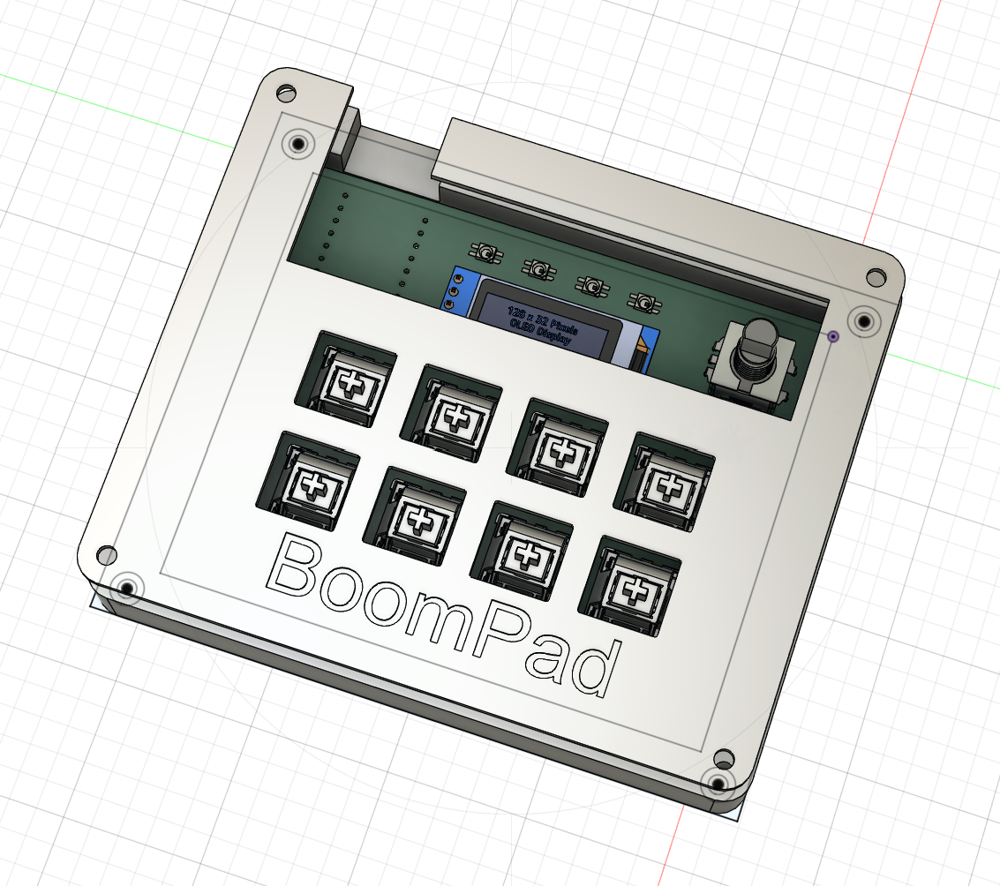
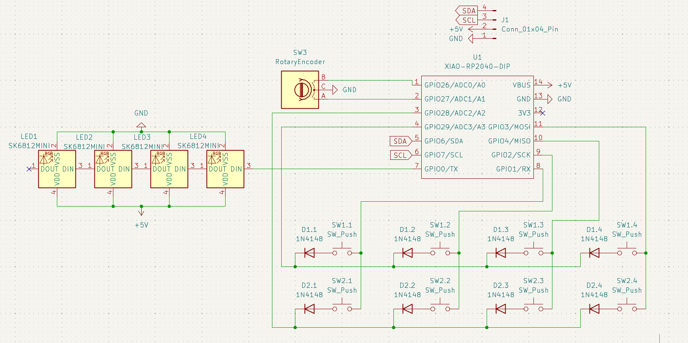
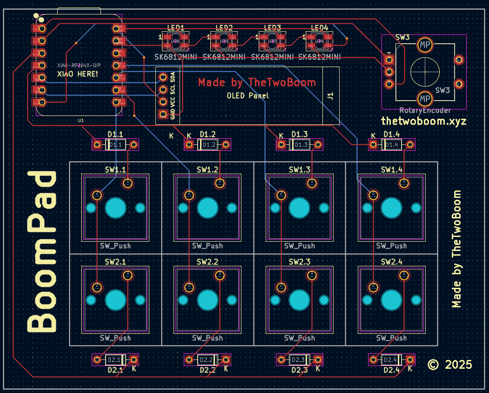
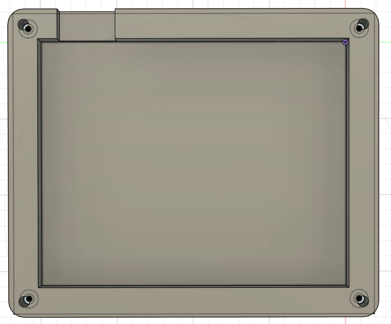
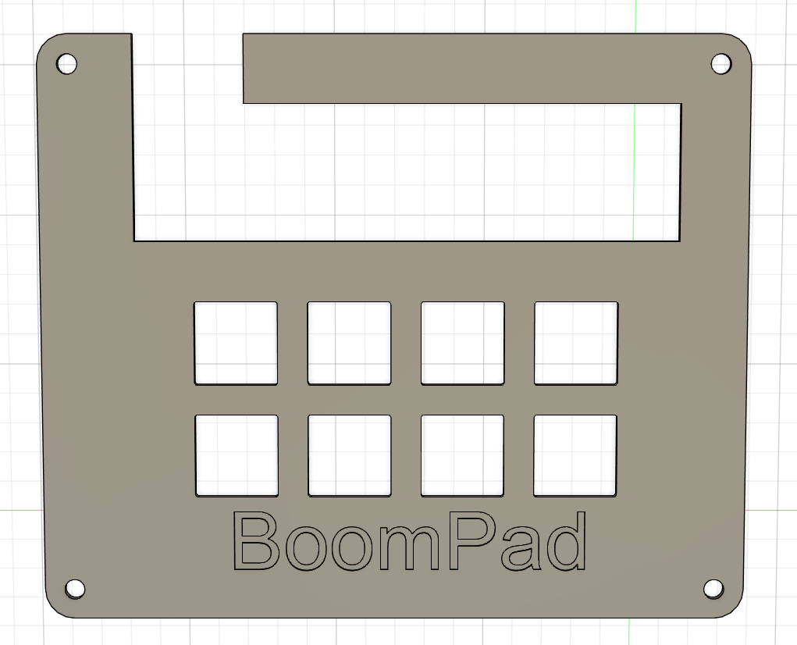

# boompad
Simple hackpad with 8 keys, an oled display, 4 Neo-LEDs, and an rotary encoder

### Inspiration
I simply wanted to kind of "max out" the hardware side of my hackpad, so I challenged myself to use the pins of the pico in the most efficient way

### Challenges
Using the correct measurements was a very difficult task, I had to redesign everything like 2-3 times until I finally noticed that my pcb was 4mm too big....

### Specifications

BOM: 
- 8x Cherry MX Switches
- 8x Through-hole 1N4148 Diodes
- 4x SK6812 MINI Leds
- 1x XIAO RP2040
- 1x EC11 Rotary encoder
- 1x 0.91 inch OLED display
- 8x Blank DSA Keycaps
- 4x M3x16 Bolt
- 4x M3 Heatset

Others:
- KMK Firmware
- TopCase.stl
- BottomCase.stl

|            Schematic             |            PCB             |                               Case                               |
|:--------------------------------:|:--------------------------:|:----------------------------------------------------------------:|
|  |  |   |

